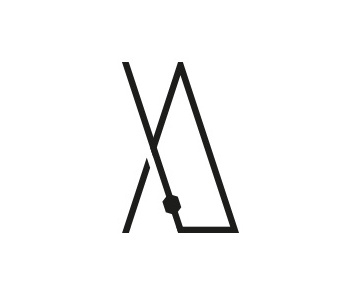
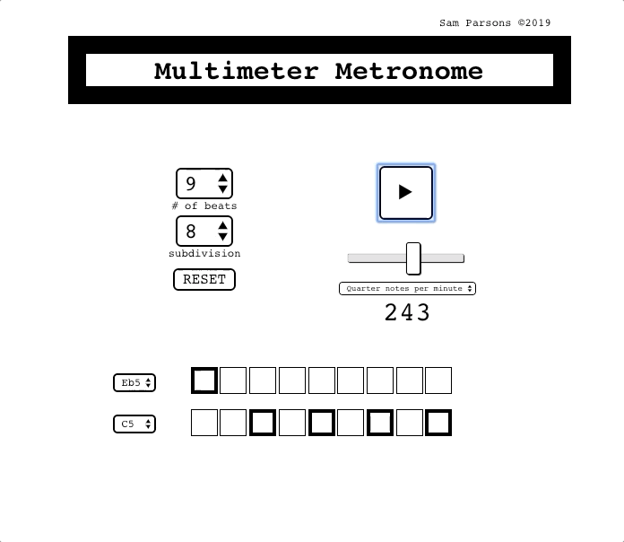

<br>

<p align="center">
  <a href="https://github.com/sam-parsons/MultiMeterMetronome">
    
  </a>
</p>

<h1 align="center">MultiMeter Metronome</h1>

<p align="center">
  Musical utility for practicing and creating rhythmic phrases</a>.
  <br>
  <a href="https://sam-parsons.github.io/MultiMeterMetronome"><strong>Live Demo »</strong></a>
</p>

<a href="https://sam-parsons.github.io/MultiMeterMetronome">
  
</a>

<br>
<br>

<p align="center">
  <a href="https://travis-ci.org/reakit/reakit"></a>
  <a href="https://codecov.io/gh/reakit/reakit/branch/master"></a><br>
  <a href="https://spectrum.chat/reakit"></a>

</p>

## Installation

```sh
git clone https://github.com/sam-parsons/MultiMeterMetronome.git

cd MultiMeterMetronome/

yarn

yarn start
```

## Features

- Beat subdivision to the 32nd note
- Two tones with variable pitch
- Step sequencer resize on time signature change

## Future Features

- Idiomatic formatting of [triple meters](https://en.wikipedia.org/wiki/Triple_metre)
- Measure Sequencing

## License

This project is licensed under the MIT License - see the LICENSE.md file for details.
