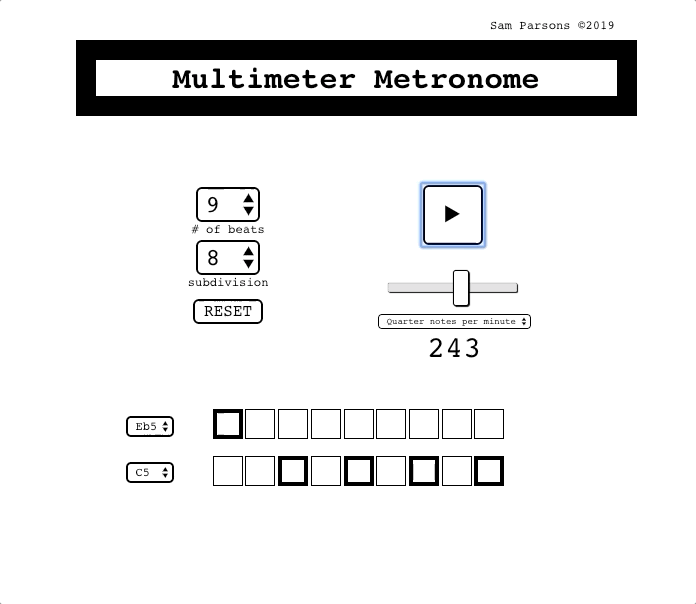

# [MultiMeter Metronome](https://sam-parsons.github.io/MultiMeterMetronome)

# Description

**MultiMeter Metronome** is an audio tool for advanced musicians that allows the user to sequence a beat pattern using two different tones. Tempo adjustment ranges from 30 to 400 Beats per Minute (BPM). This program was built in [**React**](https://reactjs.org/) using [**Tone.js**](https://tonejs.github.io/).

---
> ### View the **LIVE** in-progress demo [**HERE**](https://sam-parsons.github.io/MultiMeterMetronome)!
--- 

# Current Features

- Beat subdivision to the 32nd note
- Two tones with variable pitch

# Future Features:

- Idiomatic formatting of [triple meters](https://en.wikipedia.org/wiki/Triple_metre)
- Prevent the tempo slider callback from executing on every value increment when the user slides

# Built with

# Author

### **Sam Parsons**

# License

This project is licensed under the MIT License - see the LICENSE.md file for details.

<!--  -->
